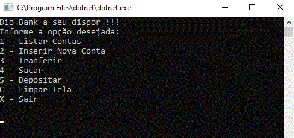

<!--Banner -->

  

<!--About session-->
<h1 align="center">DIO.Bank - Criando uma aplicação de transferências bancárias com .NET</h1>

Curso do Bootcamp "MRV .NET Developer" da [Digital Innovation One](https://digitalinnovation.one/).

## POO na prática: criando uma aplicação

- [Projeto desenvolvido](#)

<!-- 

  -->

<h3>👨‍💻 Tecnologias utilizadas</h3>

- C# .Net

<!--License session-->
<h3>📝 Licença</h3>

- Este projeto está sob a licença [MIT](./LICENSE). 

<!--Bottom session-->
 <h4 align=center>Desenvolvido com por <a target="_blank" href="" >RONISVONN GOMES</a></h4>